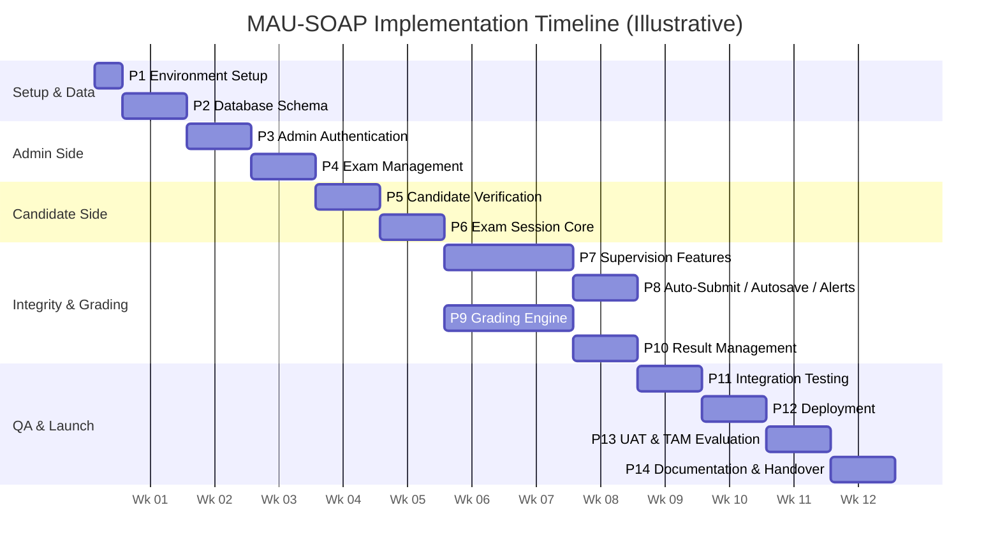

# MAU-SOAP — Implementation & Deployment Phases

This document unpacks the "Implementation" and "Deployment" stages of the Iterative
Waterfall SDLC model (Figure 3.5 in the proposal) into a concrete, dependency-ordered
build sequence. Each phase maps to the specific FR/NFR IDs defined in `Execution.md`.

## Mapping to the SDLC Model

| SDLC Macro-Phase (Fig. 3.5) | Where it lives |
|---|---|
| Requirements Gathering | Complete — captured in `Execution.md` |
| System Analysis & Design | Complete — captured in `Execution.md` + schema/diagram files |
| Implementation | Phases 1–10 below |
| Testing & Evaluation | Phases 11, 13 below |
| Deployment | Phase 12 below |
| Documentation (outside the original 5-phase model, added as necessary) | Phase 14 below |

---

## Illustrative Timeline

Durations are relative estimates for a solo developer working a single-semester project
— adjust to fit the actual academic calendar. Phases 7 (Supervision) and 9 (Grading) can
run in parallel since neither depends on the other, only on Phase 6 being complete.

---

## Phase Summary

| # | Phase | Covers | Deliverable |
|---|---|---|---|
| 1 | Environment & Project Setup | — | Runnable Flask app connected to PostgreSQL, in Git |
| 2 | Database Schema Implementation | — | Fully migrated database matching Execution.md's schema |
| 3 | Admin Authentication & Account Management | FR1, FR2, FR13, FR15, NFR2 | Default Admin provisioning plus working login/logout/reset; no registration |
| 4 | Exam Management (Admin CRUD) | FR3, FR4, FR5, FR16 | Admin can build a full exam and get a shareable link |
| 5 | Candidate Verification | FR6, NFR7, NFR8 | Candidate reaches exam-loading screen via OTP/magic link |
| 6 | Exam Session Core | FR18, FR19, part of FR10 | Server-timed session, question delivery, basic submit |
| 7 | Supervision Features | FR7, FR8, FR9 | Copy-paste block, screenshot detection, webcam monitoring live |
| 8 | Auto-Submit, Autosave/Resume, Live Alerts | FR10, FR17, FR9 (alert portion) | Session resilience + real-time Admin visibility |
| 9 | Grading Engine | FR11, FR14 | Auto-grading + manual review queue |
| 10 | Result Management & Scheduled Release | FR12 | Immediate and unattended scheduled release working, with ungraded open-ended results withheld |
| 11 | Integration & System Testing | NFR4, NFR5 | Passing test suite, documented end-to-end run |
| 12 | Deployment | NFR3, NFR5, NFR6 | Live system at mausoap.com.ng over HTTPS |
| 13 | User Acceptance Testing & TAM Evaluation | Proposal Objective iii | UAT results feeding Chapter Four |
| 14 | Documentation & Handover | NFR6 | Setup, schema, and runbook docs handed to the university |

---

## Detailed Phases

### Phase 1 — Environment & Project Setup
**Objective:** Establish the development environment and project skeleton before any feature work begins.
**Tasks:**
- Install Python 3.10+, PostgreSQL 15+, Git
- Initialize Flask project (application factory pattern, blueprints for admin/candidate/api routes)
- Set up virtual environment and dependency file
- Initialize Git repository and branching strategy
- Configure environment variables for secrets (DB URL, `SECRET_KEY`, mail credentials) — never committed to Git
- Create local PostgreSQL dev database
**Dependencies:** None — first phase.
**Deliverable:** A runnable "Hello World" Flask app connected to PostgreSQL, versioned in Git.
**Tools:** Python, Flask, PostgreSQL, Git, VS Code

### Phase 2 — Database Schema Implementation
**Objective:** Implement the full data layer per the consolidated schema (six original tables plus `verification_tokens`, `password_reset_tokens`, `answer_grades`, and all modified columns).
**Tasks:**
- Define SQLAlchemy models: User, Exam, Question, Submission, Result, WarningLog, VerificationToken, PasswordResetToken, AnswerGrade
- Apply ENUM types (role, monitor_type, release_option, question_type, violation_type, graded_by)
- Apply constraints: foreign keys, `UNIQUE(exam_id, candidate_email)`, unique `exam_link_token`
- Use JSONB for `responses` and `options` columns
- Generate and run the initial migration
- Add an idempotent initialization/seed command that creates the single default Admin from environment-supplied credentials, plus a dummy exam for development use
**Dependencies:** Phase 1
**Deliverable:** Fully migrated database matching `Execution.md`'s schema, plus a seed script.
**Tools:** SQLAlchemy, Flask-Migrate (Alembic), PostgreSQL, pgAdmin 4

### Phase 3 — Admin Authentication & Account Management
**Covers:** FR1, FR2, FR13, FR15, NFR2
**Objective:** Provision the single default Admin and build login, logout, and password reset without any public registration capability.
**Tasks:**
- Configure default Admin email/password through environment variables and create the account through the idempotent initialization/seed command
- Hash the default Admin password via Flask-Bcrypt before storage
- Do not create an Admin registration page, route, API endpoint, or account-creation form
- Login/logout via Flask-Login; `@admin_required` route decorator
- Password reset flow: request → token generation → email → reset form → validation → update
**Dependencies:** Phase 2
**Deliverable:** The default Admin can log in, log out, and reset the password; attempts to access any registration path are unavailable.
**Tools:** Flask-Login, Flask-Bcrypt, Flask-Mail, Python `secrets`

### Phase 4 — Exam Management (Admin CRUD)
**Covers:** FR3, FR4, FR5, FR16
**Objective:** Allow Admins to create, configure, edit, and delete exams and questions.
**Tasks:**
- Exam creation form/route (title, course info, supervision settings)
- Configure only the time limit and monitor type per exam; enforce the warning limit as a fixed system-wide value of 3
- Question creation for all three types (mcq / open_ended / short_answer), with `options` JSON for MCQ using key-based options
- Generate a CSPRNG `exam_link_token` on creation
- Edit/delete routes, guarded by a check that blocks structural changes as soon as any Candidate has a submission/session record with `started_at`
- Admin dashboard listing the Admin's own exams
**Dependencies:** Phase 3
**Deliverable:** An Admin can fully build an exam end-to-end and obtain a shareable link.
**Tools:** Flask, Jinja2, SQLAlchemy, Python `secrets`

### Phase 5 — Candidate Verification (OTP + Magic Link)
**Covers:** FR6, NFR7, NFR8
**Objective:** Implement the passwordless candidate verification flow.
**Tasks:**
- Exam-link landing page (name + email form)
- Environment-configured domain validation using `CANDIDATE_EMAIL_DOMAIN` (`gmail.com` for development/testing, later changed to `mau.edu.ng` for final production use)
- OTP + magic-link token generation and hashing, stored in `verification_tokens`
- Email dispatch via Flask-Mail
- OTP verification endpoint and magic-link verification endpoint
- Attempt counting and lockout after 5 failures
- Issue a resume/session token on successful verification
**Dependencies:** Phase 4 (needs an exam to verify against)
**Deliverable:** A candidate can enter their email, receive an OTP/link, and reach the exam-loading screen.
**Tools:** Flask-Mail, Python `secrets`, `hashlib`/`passlib`

### Phase 6 — Exam Session Core
**Covers:** FR18, FR19, part of FR10
**Objective:** Get a verified candidate from landing on the exam to submitting it, with a real, server-trusted clock.
**Tasks:**
- Submission/session record creation when the verified Candidate starts the exam, with `started_at` set server-side; this immediately locks the exam against structural editing and deletion
- Question delivery endpoint (serves questions to verified candidates only)
- Server-side remaining-time calculation endpoint
- Client-side timer display that resyncs against the server periodically
- Basic manual submit endpoint (stores responses + `submitted_at`; grading comes later)
- Enforce the unique-submission constraint and lock writes after submission
**Dependencies:** Phase 5
**Deliverable:** A candidate can take an exam under a server-enforced timer and submit once.
**Tools:** Flask, SQLAlchemy, vanilla JS, Python `datetime`

### Phase 7 — Supervision Features
**Covers:** FR7, FR8, FR9
**Objective:** Implement all three real-time integrity controls during an active session.
**Tasks:**
- Copy-paste prevention via the Clipboard API and `keydown`/`contextmenu` interception
- Screenshot detection via capture-related keyboard shortcuts and Page Visibility/`blur` listeners
- Integrate MediaPipe Face Landmarker client-side (face-presence or gaze-deviation detection based on the exam's `monitor_type`)
- Violation-event POST endpoint writing to `warning_log` and incrementing `warn_count`
- On-screen warning UI shown to the candidate on each violation
**Dependencies:** Phase 6
**Deliverable:** All three supervision mechanisms actively detecting and logging violations during a live session.
**Tools:** MediaPipe Tasks Vision (JS), browser MediaDevices API, vanilla JS, Flask

### Phase 8 — Auto-Submission, Autosave/Resume, and Admin Live Alerting
**Covers:** FR10, FR17, FR9 (alert portion)
**Objective:** Close the loop on session resilience and live Admin oversight.
**Tasks:**
- Fixed warning-limit check that triggers auto-submission immediately when `warn_count` reaches 3
- Periodic autosave (debounced) of in-progress responses
- Resume endpoint restoring responses, remaining time, and warn count via the resume token
- Admin live-warnings polling endpoint and dashboard widget showing active candidates' violations as they occur
**Dependencies:** Phase 7
**Deliverable:** A dropped connection doesn't lose progress; an Admin watching the dashboard sees violations in near-real-time; threshold breaches auto-submit correctly.
**Tools:** Vanilla JS, Flask, SQLAlchemy (JSONB), browser `localStorage`

### Phase 9 — Grading Engine
**Covers:** FR11, FR14
**Objective:** Implement automatic and manual grading.
**Tasks:**
- AutoGrade routine: exact-key match for MCQ, configurable case/space-tolerant matching for short-answer
- Create an `answer_grades` row per question on submission (NULL `awarded_marks` for open-ended)
- Admin "pending review" queue listing flagged responses
- Manual mark-assignment endpoint; recompute `Result.status` once every row for a submission is graded
**Dependencies:** Phase 6 (needs real submissions to grade — can proceed in parallel with Phases 7–8)
**Deliverable:** A submitted exam is scored automatically where possible and clearly queued for manual grading where not.
**Tools:** Python, SQLAlchemy

### Phase 10 — Result Management & Scheduled Release
**Covers:** FR12
**Objective:** Give Admins control over when results become visible, including unattended scheduled release.
**Tasks:**
- Immediate-release path, triggered by Admin action
- Internal `/internal/release-results` endpoint, protected by an internal auth key
- Cron job configuration hitting that endpoint on an interval
- Scheduled-release eligibility check requiring `Result.status == complete`; keep results with ungraded open-ended responses withheld for reconsideration on the next scheduled run
- Candidate-facing result view, visible only once released
- Optional release-notification email
**Dependencies:** Phase 9
**Deliverable:** Both release modes work end-to-end, including the fully automated scheduled path.
**Tools:** Linux `cron`, Flask, Flask-Mail (optional)

### Phase 11 — Integration & System Testing
**Covers:** NFR4, NFR5
**Objective:** Verify the whole pipeline end-to-end and catch integration issues across Phases 3–10.
**Tasks:**
- Unit tests for grading logic, matching rules, token expiry, lockout behavior, the fixed third-warning auto-submit rule, and configured candidate-domain validation
- Authorization/behavior tests confirming that no Admin registration endpoint exists and only the seeded default Admin can authenticate
- Exam-lock test confirming that the first Candidate start prevents structural editing/deletion before final submission
- Scheduled-release test confirming that results with ungraded open-ended responses remain withheld until grading is complete
- Manual end-to-end test: full lifecycle from admin exam creation through candidate verification, exam-taking, violations, auto-submit/resume, grading, and release
- Light load/performance smoke test simulating multiple concurrent candidates
- Security review: token entropy, hashed storage, HTTPS-only cookies, SQL-injection safety via the ORM
**Dependencies:** Phases 8 and 10 both complete
**Deliverable:** Passing test suite, a documented end-to-end test run, and a resolved (or logged) known-issues list.
**Tools:** pytest, Postman

### Phase 12 — Deployment (Production Infrastructure)
**Covers:** NFR3, NFR5, NFR6
**Objective:** Move the system from local development to production at mausoap.com.ng.
**Tasks:**
- Provision the Linux VPS per the hardware requirements
- Install a production PostgreSQL instance, migrate the schema, restrict network access
- Configure Gunicorn (multiple workers) running the Flask app
- Configure Nginx as a reverse proxy in front of Gunicorn
- Obtain and configure a TLS certificate via Let's Encrypt/Certbot; enforce HTTPS
- Set production environment variables/secrets (never committed to Git)
- Set `CANDIDATE_EMAIL_DOMAIN=mau.edu.ng` before final production use; retain `gmail.com` only for development and controlled testing
- Configure the production cron job for scheduled result release
- Set up automated PostgreSQL backups
- Point the mausoap.com.ng domain at the server
**Dependencies:** Phase 11
**Deliverable:** A live, HTTPS-secured system accessible at mausoap.com.ng.
**Tools:** Gunicorn, Nginx, Certbot, cron, `pg_dump`

### Phase 13 — User Acceptance Testing & TAM Evaluation
**Covers:** Proposal Objective iii (usability/effectiveness evaluation), Chapter Four (TAM survey)
**Objective:** Validate the deployed system with real users per the study's methodology (purposive sample: 5 lecturers, 25 students).
**Tasks:**
- Recruit the sample from the Department of Computer Science
- Run a pilot exam with real Admin and Candidate participants
- Administer the TAM questionnaire (Perceived Usefulness / Perceived Ease of Use)
- Collect and analyze feedback; log any usability issues or bugs found
**Dependencies:** Phase 12
**Deliverable:** UAT results feeding into Chapter Four of the project report; critical fixes looped back into a patch release.
**Tools:** Survey instrument (outside the software stack)

### Phase 14 — Documentation & Handover
**Covers:** NFR6
**Objective:** Ensure the university can maintain and extend the system after project completion.
**Tasks:**
- Write a setup/installation README
- Document environment variables and secrets management
- Document the database schema (ERD + table reference)
- Document a deployment runbook (redeploying, rotating secrets, restarting services)
- Finalize the project report, referencing `Execution.md` and this document
**Dependencies:** Phase 13
**Deliverable:** Complete documentation package handed over alongside the codebase.
**Tools:** Markdown, Git repository README

---

## Note on Iteration

The proposal explicitly adopts an *Iterative* Waterfall model (Fig. 3.5), permitting
movement back to an earlier phase when testing surfaces an issue. In practice this means,
for example, a bug found in Phase 11 tracing back to the grading logic in Phase 9 should
be fixed in Phase 9 and re-verified in Phase 11 — not patched over in testing. The phase
order above is the intended build sequence, not a one-way gate.
